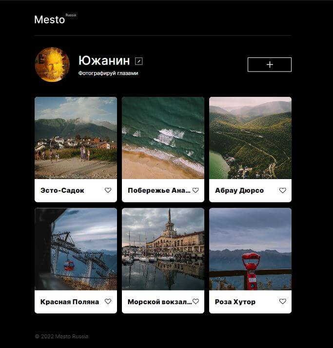

# Проект: Место React

## [Демонстрация сайта](https://marusillda.github.io/mesto-react/)

## ***Содержание:***
- [Описание проекта](#Description)
- [Используемые технологии](#Technologies)
- [Структура каталога проекта](#ProjectStructure)
- [Оценка качества кода](#Quality)
- [Планы по доработке проекта](#Planes)

# Описание проекта 

**Место** — самостоятельный интерактивный проект в рамках обучения на курсе "Web-разработчик" в Яндекс Практикум с использованием React. В рамках обучения для выполнения проектной работы был предоставлен макет в программе [Figma](https://www.figma.com/file/2cn9N9jSkmxD84oJik7xL7/JavaScript.-Sprint-4?node-id=0%3A1), по которому нужно было сверствать сайт.
Проект "Место" должен корректно отображаться на экранах размеров 1280px и 320px.

# Используемые технологии 

1. Проект реализован с помощью framework React и утилиты Create React App (CRA).
2. Использованы функциоанльные и классовые компоненты, хуки.
3. Элементы пользовательнского интерефейса описаны с помощью JSX — это расширение синтаксиса JavaScript.
4. За описание внешнего вида сайта отвечает язык каскадных таблиц стилей CSS.
5. Все элементы страницы и стили реализованы в соответствии с концепцией [БЭМ](https://ru.bem.info/methodology/quick-start/).
6. При размещении элементов на странице использовалась технология для создания сложных гибких макетов [CSS Flexbox](https://doka.guide/css/flexbox-guide/) и технология [CSS Grid Layout](https://doka.guide/css/flexbox-guide/), которая предлагает систему компоновки на основе сетки со строками и столбцами.
7. Все кнопки на странице имеют состояние наведении мыши. Этот эффект реализован с использованием [псевдоклассов](https://doka.guide/css/pseudoclasses/) и свойства [CSS Transition](https://doka.guide/css/transition/).
8. Изменение внешнего вида элемнтов для корректного отображения на устройствах разного типа реализовано с помощью директив CSS - [медиазапросов](https://doka.guide/css/media/).
9. Плавное открытие и закрытие попапов реализовано с помощью свойств СSS visibility, opacity и transition.
10. Проект поключен к серверу. Адрес сервера проекта Mesto: https://mesto.nomoreparties.co. С сервера загружаются:
  - Информация о пользователе
  - Карточки
  - Количество лайков
11. Создан объект контекста и использован провайдер для передачи данных пользователя во все компоненты.
12. Реализована поддержка лайков и дизлайков.
13. Реализовано удаление карточки, добавленной полььзователем, и добаление карточки с новым местом.
14. Добавлена возможность редактировать данные ползователя.
15. Для получения значений инпутов использован как рефы, так и управляемые копоненты.

# Оценка качества кода 
Качество кода обусловлено его проверкой по чек-листу Яндекс Практикума, автоматическими проверками и код-ревью специалистом Яндекс Практикума.

# Планы по доработке проекта 
- сделать фалидацию форм.
- добавить индикатор запросов.
- добавить попап подтверждения удаления карточки с местом.

# Getting Started with Create React App

This project was bootstrapped with [Create React App](https://github.com/facebook/create-react-app).

## Available Scripts

In the project directory, you can run:

### `npm start`

Runs the app in the development mode.\
Open [http://localhost:3000](http://localhost:3000) to view it in your browser.

The page will reload when you make changes.\
You may also see any lint errors in the console.

### `npm test`

Launches the test runner in the interactive watch mode.\
See the section about [running tests](https://facebook.github.io/create-react-app/docs/running-tests) for more information.

### `npm run build`

Builds the app for production to the `build` folder.\
It correctly bundles React in production mode and optimizes the build for the best performance.

The build is minified and the filenames include the hashes.\
Your app is ready to be deployed!

See the section about [deployment](https://facebook.github.io/create-react-app/docs/deployment) for more information.

### `npm run eject`

**Note: this is a one-way operation. Once you `eject`, you can't go back!**

If you aren't satisfied with the build tool and configuration choices, you can `eject` at any time. This command will remove the single build dependency from your project.

Instead, it will copy all the configuration files and the transitive dependencies (webpack, Babel, ESLint, etc) right into your project so you have full control over them. All of the commands except `eject` will still work, but they will point to the copied scripts so you can tweak them. At this point you're on your own.

You don't have to ever use `eject`. The curated feature set is suitable for small and middle deployments, and you shouldn't feel obligated to use this feature. However we understand that this tool wouldn't be useful if you couldn't customize it when you are ready for it.

## Learn More

You can learn more in the [Create React App documentation](https://facebook.github.io/create-react-app/docs/getting-started).

To learn React, check out the [React documentation](https://reactjs.org/).

### Code Splitting

This section has moved here: [https://facebook.github.io/create-react-app/docs/code-splitting](https://facebook.github.io/create-react-app/docs/code-splitting)

### Analyzing the Bundle Size

This section has moved here: [https://facebook.github.io/create-react-app/docs/analyzing-the-bundle-size](https://facebook.github.io/create-react-app/docs/analyzing-the-bundle-size)

### Making a Progressive Web App

This section has moved here: [https://facebook.github.io/create-react-app/docs/making-a-progressive-web-app](https://facebook.github.io/create-react-app/docs/making-a-progressive-web-app)

### Advanced Configuration

This section has moved here: [https://facebook.github.io/create-react-app/docs/advanced-configuration](https://facebook.github.io/create-react-app/docs/advanced-configuration)

### Deployment

This section has moved here: [https://facebook.github.io/create-react-app/docs/deployment](https://facebook.github.io/create-react-app/docs/deployment)

### `npm run build` fails to minify

This section has moved here: [https://facebook.github.io/create-react-app/docs/troubleshooting#npm-run-build-fails-to-minify](https://facebook.github.io/create-react-app/docs/troubleshooting#npm-run-build-fails-to-minify)
